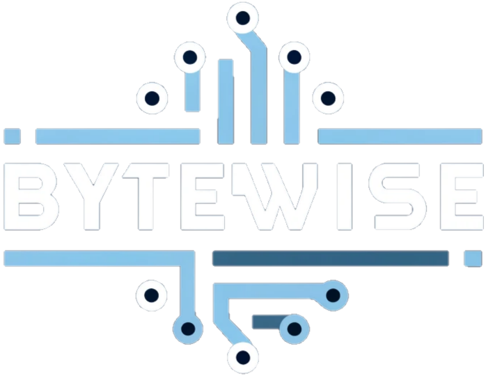

<p align="center">
  
</p>

# ByteWise : A Quality of Life IOT App For ESP32
### Developed By : Jayden Roelofs | Chris Lamus
### Department : Computer Science and Engineering
### Jira Link: [ByteWise](https://cis350roelofja.atlassian.net/jira/software/projects/BYT/boards/2?atlOrigin=eyJpIjoiMTA2YWY0MzlkMTRlNDM2NTlkNDljZDI0ZWU4NzE2MGYiLCJwIjoiaiJ9)
---
## 1 Abstract

When working with microcontrollers, development and programming can be tedious and time consuming for the unexperienced user, especially if they have not had any previous exposure. Whether it's a passion project or someone simply wants to experiement, the complexity that can come with microcontrollers could be discouraging to the average user. The **ByteWise** app aims to simplify the development process by providing a user friendly interface to connect an ESP-32 and begin development right away.

## 2 Introduction

**ByteWise** is an Android mobile application enabling fast development for the ESP-32. The app allows a user to connect multiple boards, where they can individually by customized to the desired configuration. Once a board is connected, the **ByteWise** app provides the user with a list of I/O pins accompanied by a pin functionality option. This allows the user to customize their board to their liking with the simple interface of the **ByteWise** app.
## 3 Architectural Design

The **ByteWise** app communicates with the ESP-32 using a wifi connection. Once the app and the ESP-32 are on a wifi network, they communicate using an MQTT broker to send and recieve updates. The app sends the user's currently configured settings as a json string to the ESP-32 where the ESP-32 then parses that string and sets the pins accordingly. The app recieves live board connection status updates showing the user whether their board is connected or disconnected from the app. When a configuration string is sent to the board, the ESP-32 uses it's built in SPIFFS file system to create and store a local json file containing the configuration settings. This allows the board tp pull and reapply the configuration settings after the board is reset or looses power. 

### 3.1 Use Case Diagram

### 3.2 Class Diagram

### 3.3 Sequence Diagram

## 4 User Guide/Implementation

### 4.1 ESP-32 Code
The following code must be uploaded to your ESP-32 in order for the ByteWise app to communicate with it. You can do this using the Arduino IDE. Before the code can be uploaded, you must install the **"PubSubClient"** and **"ArduinoJson"** packages available in the LibraryManager tab within the Arduino IDE. You must replace the
```BYTEWISE_DEVICE_TOKEN``` with the token provided when creating a new board in the app, and the ```ssid[]``` and ```password[]``` with your network's ssid and password credentials.

```cpp
/**
 * @file esp32.ino
 *
 * @brief ESP-32 ByteWise code. This code must be uploaded to a ESP-32
 * to communicate with the ByteWise application.
 *
 * @authors Jayden Roelofs, Chris Lamus
 * 
 */

#include <ArduinoJson.h>
#include <WiFi.h>
#include <PubSubClient.h>
#include <SPIFFS.h>

/* Your unique ByteWise device token goes here */
#define BYTEWISE_DEVICE_TOKEN "######"

/* Your WiFi information goes here */
char ssid[] = "YourNetworkSSID";
char password[] = "YourNetworkPassword";

#define MQTT_SERVER "bytewise.cloud.shiftr.io"
#define MQTT_PORT 1883
#define MQTT_USER "bytewise"
#define MQTT_PASS "gDQI0dHuCD0bXwTG"

JsonDocument config; // Locally stored device config variable

WiFiClient espClient;
PubSubClient client(espClient);

String clientId; // Unique client ID for this device
String deviceTopic; // Unique app instance topic
String statusTopic; // Unique status/will topic for this device

void setupWifi();
void setupMqtt();
void messageRecievedCallback(char* topic, byte* payload, unsigned int length);
void reconnect();
void applyConfig(JsonDocument config);
void saveConfigToFile(JsonDocument config);
void loadConfigFromFile(JsonDocument& config);

/**
 * The code run on startup
 *
 * Sets up the SPIFFS filesystem, connects to wifi, sets up MQTT
 * connection, loads the stored configuration file, and applies
 * the config file.
 * 
 */
void setup()
{
    Serial.begin(115200);
    if(!SPIFFS.begin(true))
    {
        Serial.println("Failed to mount file system");
        return;
    }
    setupWifi();
    setupMqtt();
    loadConfigFromFile(config);
    applyConfig(config);
}

/**
 * The code run continuously
 *
 * connects to the MQTT broker and handles disconnects
 * 
 */
void loop()
{
    if(!client.connected())
    {
        reconnect();
    }
    client.loop();
}

/**
 * Connects the board to wifi
 *
 * Connects to a wif network using the ssid and password
 * entered at the top of the program
 * 
 */
void setupWifi()
{
    delay(10);
    Serial.println();
    Serial.print("Connecting to ");
    Serial.print(ssid);
    WiFi.begin(ssid, password);
    while(WiFi.status() != WL_CONNECTED)
    {
        delay(500);
        Serial.print(".");
    }
    Serial.println("\nWiFi connected");
    Serial.print("IP address: ");
    Serial.println(WiFi.localIP());
}

/**
 * Sets up configs for the ByteWise MQTT broker
 *
 * Creates a unique client ID from the board's MAC address.
 * Configures the client to connect to the ByeWise MQTT broker.
 * Creates unique topics for the ByteWise app to communicate over,
 * and sets up message recieved callback and keep alive period.
 * 
 */
void setupMqtt()
{
    uint64_t chipId = ESP.getEfuseMac(); // ESP32 MAC address

    clientId = "ESP32-" + String(chipId, HEX);
    deviceTopic = "/devices/" BYTEWISE_DEVICE_TOKEN;
    statusTopic = deviceTopic + "/status";

    client.setServer(MQTT_SERVER, MQTT_PORT);
    client.setCallback(messageRecievedCallback);
    client.setKeepAlive(1);
}

/**
 * The function called whenever a message is recieved from the broker
 *
 * Parses the incomming json string and converts it to useable data.
 * Saves the config to a json file on the filesystem and then applies it
 * to the board.
 * 
 */
void messageRecievedCallback(char* topic, byte* payload, unsigned int length)
{
    // Parse the JSON message
    DeserializationError error = deserializeJson(config, payload);
    
    // Check for parsing errors
    if(error)
    {
        Serial.print("deserializeJson() failed: ");
        Serial.println(error.c_str());
        return;
    }

    saveConfigToFile(config);
    applyConfig(config);
}

/**
 * Connects and reconnects to the MQTT broker
 *
 * Connects to the broker when there is no connection.
 * Establishes the will message when the board is diconnected and
 * sends a message on connection to notify the app that the board is
 * online.
 * 
 */
void reconnect()
{
    while(!client.connected())
    {
        Serial.println("Attempting MQTT connection...");
        if(client.connect(clientId.c_str(), MQTT_USER, MQTT_PASS, 
                          statusTopic.c_str(), 1, true, "0"))
        {
            Serial.println("MQTT connected");
            client.subscribe(deviceTopic.c_str());
            client.publish(statusTopic.c_str(), "1", true);
        }
        else
        {
            Serial.print("Failed, rc=");
            Serial.print(client.state());
            Serial.println("Trying again in 5 seconds...");
            delay(5000);
        }
    } 
}

/**
 * Applies a json configuration
 *
 * Loops through each pin configuration and applies each setting of
 * the JsonDocument.
 * 
 */
void applyConfig(JsonDocument config)
{
    JsonArray configArray = config["config"];

    for(JsonObject obj : configArray)
    {
        uint8_t gpio = obj["gpio"];
        uint8_t mode = obj["mode"];
        uint8_t output = obj["output"];

        pinMode(gpio, mode);
        Serial.println("Pin " + String(gpio) + " set to mode " + String(mode));
        if(mode == OUTPUT)
        {
            digitalWrite(gpio, output);
            Serial.println("Pin " + String(gpio) + " output set to " + String(output));
        }
    }
}

/**
 * Converts a config to a json document and stores it on the ESP
 *
 * Creates a json file if there is not one already puts the JsonDocument
 * contents inside.
 * 
 */
void saveConfigToFile(JsonDocument config)
{
    File configFile = SPIFFS.open("/config.json", "w");
    if(!configFile)
    {
        Serial.println("Failed to open config file for writing");
        return;
    }

    serializeJson(config, configFile);
    configFile.close();
    Serial.println("Config saved to file");
}

/**
 * Load the config stored on the SPIFFS json and apply the settings
 *
 * Loads the config from the SPIFFS json, desearializes it, and stores it
 * into the config JsonDocument to use throughout the program.
 * 
 */
void loadConfigFromFile(JsonDocument& config)
{
    File configFile = SPIFFS.open("/config.json", "r");
    if(!configFile)
    {
        Serial.println("Failed to open config file");
        return;
    }

    DeserializationError error = deserializeJson(config, configFile);
    if(error)
    {
        Serial.print("deserializeJson() failed: ");
        Serial.println(error.c_str());
        return;
    }

    configFile.close();
    Serial.println("Config loaded from file");
}
```

### 4.1 Client Side

#### 4.1.1 Starting the Application

#### 4.1.2 Registration

#### 4.1.3 LogIn

### 4.2 Home

#### 4.2.1 Vehicle Details

#### 4.2.2 Adding Garage as Renter

#### 4.2.3 Location Selection for Parking

#### 4.2.4 Notification Details

### 4.3 Confirmation and Payment

### 4.4 Server Side

## 5 Future Scope
Due to limitations in time, some features and ideas that we wanted to implement did not make it in time for the project deadline. With more development, we wanted to add the ability to change the wifi network used for the ESP-32 from within the app after a board was connected for the first time using some sort of OTA update system. Additionally, we wanted to add more pin functions other than just input and output such as predefined functions like a blink mode, or additional board features like PWM. We also wanted to add a login screen and account system to remember a users settings after the app is closed and to better provide the user with the ESP startup code.
## 6 Risk Analysis and Retrospective
A major risk when developing this project was the potential of not being able to get the board and the app to communicate at all. We did not have much experience with communications over wifi networks so it took some time to figure out how to use the MQTT broker. We had to do a lot of development research to figure out how to connect the app and the ESP-32 to the broker and then develop a messaging system to get them to communicate with each other with relevent information. We faced issues with making each board independent from one another and have their own app connections. By making the board a class within the app and generating a unique token for each board that the user enters in thier ESP code, we were able to accomplish this. There was also a major issue getting the app to properly display the connection status of each board. When a board is connected we send a status message to the broker, and using the will message property of MQTT messaging we were able to send a message to the broker when the board was disconnected by any means. The problem was working around the app recieving the status message from the board and flutter widget states. There were many instances of the app crashing when a board was connected or disconnected which were fixed by handling states in a Provider which is a flutter package. Using the provider we made the callback used whenever the client recieved a message ping the status consumer that the state had changed. This fixed the status issue and made it correctly display. 

The settings for the board that can be selected work, but ultimately are very limiting in what you can accomplish. We wanted to add more settings for the user to add but were limited by time. Additionally the UI for the lists of configurations could be improved and more user friendly to give a better idea of what the configured setting is doing. Originally during development you could only connect one board, however by isolating each board and its properites in a class we were able to connect multiple at a time. This is something we are proud got implimented as adding this caused a lot of bugs that had to be sorted. Currently the code that the user has to upload to thier board is located within this readme. If the user login and account creation was implemented we would have liked the code to be sent to the user's email.
## 7 Walkthrough
